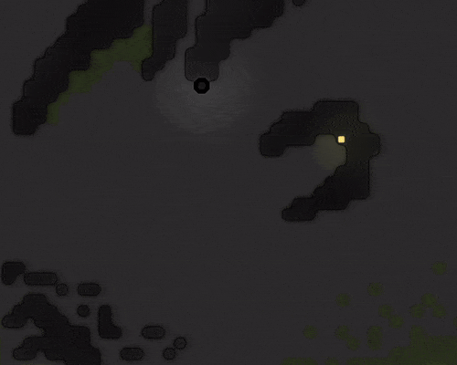

# A Steve is Born

## Initial setup

A very simple main.ts


```typescript
//import { ErrorMapper } from "utils/ErrorMapper";
import { gameLoop } from "loop";

// When compiling TS to JS and bundling with rollup, the line numbers and file names in error messages change
// This utility uses source maps to get the line numbers and file names of the original, TS source code
//export const loop = ErrorMapper.wrapLoop(gameLoop);

export const loop = gameLoop;
```


The main loop code was moved to the 'loop.ts' file which holds the code responsible for handling each loop step. The main.ts then can optionally use the ErrorMapper or not.


```typescript
import { CreepManager } from "managers/CreepManager";
import { SpawnManager } from "managers/SpawnManager";
import { cleanMemory } from "utils/GameUtils";

export const gameLoop = () => {
  console.log(`Current game tick is ${Game.time}`);
  cleanMemory();

  SpawnManager.run();
  CreepManager.run();
};

```


### SpawnManager

The loop.ts module is responsible for calling the higher-level functions, like deleting creeps from memory that no longer exist and running the managers.


```typescript
import { CreepRole } from "enums/CreepRole";

export class SpawnManager {

    public static run() {
        for (var name in Game.spawns) {
            var spawn = Game.spawns[name];
            SpawnManager.runSpawn(spawn);
        }
    }

    private static runSpawn(spawn: StructureSpawn) {
        var result = spawn.spawnCreep([WORK, MOVE, CARRY], "Steve", {
            dryRun: true
        });

        if (result === OK) {
            spawn.spawnCreep([WORK, MOVE, CARRY], "Steve", {
                dryRun: false,
                memory: {
                    role: CreepRole.runner,
                    room: "",
                    working: false
                }
            });
        }
    }

}

```


The SpawnManager is responsible for creating new creeps. This initial code only allows for one creep to exist at a time, called Steve. Steve is hard-coded to have a role of 'runner', but this will change in the future to be more dynamic.



The above GIF shows the code running in a training room. 

### CreepManager


```typescript
import { RunnerCreep } from "creeps/RunnerCreep";
import { CreepRole } from "enums/CreepRole";

export class CreepManager {

    public static run() {
        for(var name in Game.creeps) {
            var creep = Game.creeps[name];
            CreepManager.runCreep(creep);
        }
    }

    private static runCreep(creep: Creep) {
        var creepRole = creep.memory.role;

        switch (creepRole) {
            case CreepRole.runner:
                RunnerCreep.run(creep);
                break;
            default:
                console.log(`unknown creep role '${creepRole}'`);
                break;
        }
    }
}

```


A creep manager is responsible for controlling all the creeps. It keeps track of a creep's role and delegates the behaviour to each role's class.

### Creep role - Runner

```typescript
interface RunnerCreepMemory extends CreepMemory {
    state: RunnerCreepState
}

export enum RunnerCreepState {
    harvesting,
    running,
}

export class RunnerCreep {

    public static run(creep: Creep) {
        var memory = creep.memory as RunnerCreepMemory;

        switch (memory.state) {
            default:
            case RunnerCreepState.harvesting:
                var source = getClosestSource(creep);
                memory.state = harvest(creep, source);
                break;
            case RunnerCreepState.running:
                var spawn = getClosestSpawn(creep);
                memory.state = running(creep, spawn);
                break;
        }
    }
}
```

A runner can be one of two states: 'harvesting' or 'running'. 

#### Harvesting

When harvesting the creep moves to the nearest energy source and starts harvesting. Once full, the creep changes its state to 'running'

```typescript
function harvest(creep: Creep, source: Source): RunnerCreepState {
    var result = creep.harvest(source);
    if(result === ERR_NOT_IN_RANGE) {
        creep.moveTo(source);
    }

    if (creep.store.getFreeCapacity() === 0) {
        creep.say("running");
        return RunnerCreepState.running;
    }

    return RunnerCreepState.harvesting;
}
```

#### Running

When running the creep will move to the nearest spawn structure and transfer all of its energy, after which the state will go back to harvesting.

```typescript
function running(creep: Creep, spawn: StructureSpawn): RunnerCreepState {
    var result = creep.transfer(spawn, RESOURCE_ENERGY);

    if (result === ERR_NOT_IN_RANGE) {
        creep.moveTo(spawn);
    }

    if (creep.store.getUsedCapacity() === 0) {
        creep.say("harvesting");
        return RunnerCreepState.harvesting;
    }

    return RunnerCreepState.running;
}
```


 Super-powers are granted randomly so please submit an issue if you're not happy with yours.


Once you're strong enough, save the world:


