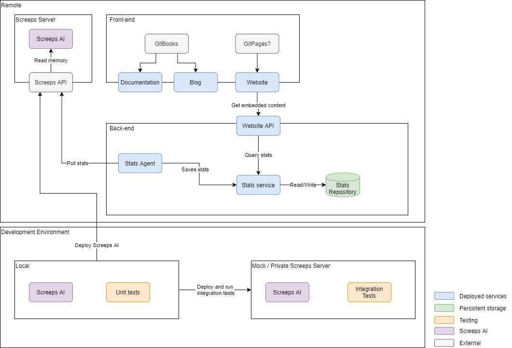

# Initial Plan

The project so far has consisted of setting up the core development environment, getting a working version of the AI deployed and investigating ways of measuring performance in the live environment.





I now have a general idea of what is possible and so I can come up with a plan of what I want the project to include and how I want the project to be structured.

## Project Structure

### Screeps AI

Code that is designed to run in the screeps environment. It will be written in TypeScript and transpiled into JavaScript before being deployed to the screeps server. It will have two main responsibilities:

* Use the Screeps API \(internal library\) to play the game
* Provide statistics to be collected by the [Stats Agent](initial-plan.md#stats-agent)

### Stats Agent

A self-contained program which polls the Screeps API for stats provided by the AI and forwards them to the [Stats Service](initial-plan.md#stats-service).

### Stats Service

* Provides an interface for the Stats Agent to send metrics
* Stores metrics
* Provides an interface to query / visualise the metrics

### Front-end Websites

#### Documentation

Provides up-to-date information about the project's implementation.

#### Blog

Follows the project's development as it happens with the aim of recording thought processes and decisions made along the way

#### Website

A more general website for showing anything not included in the documentation or blog. So far I see this website showing real-time information about the Screep AI as well as visualising some performance metrics from the stats service. The idea would be to make as much of the feedback I would use in the development process publicly available.

### Testing

#### Unit testing

Have strong unit testing which will be an interesting challenge for a program that is heavily reliant on the Screeps environment.

#### Integration Testing

Testing against the as close as the real thing as possible. We want Steve to prosper and not to implode. Copies of Steve, made for integration testing, don't count.

