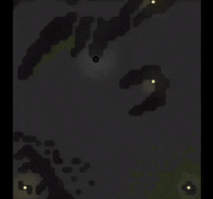

# MVP

Now that Steve has been born we can start progressing within the game. In order to progress within the game and unlock new features, Screeps provides a way to 'level-up'. To achieve this, Steve will need to harvest energy and upgrade the controller.

### CreepManager


```typescript
import { Steve } from "creeps/Steve";
import { CreepRole } from "enums/CreepRole";

export class CreepManager {

    public static run() {
        for(var name in Game.creeps) {
            var creep = Game.creeps[name];
            CreepManager.runCreep(creep);
        }
    }

    private static runCreep(creep: Creep) {
        var creepRole = creep.memory.role;

        switch (creepRole) {
            case CreepRole.runner:
                Steve.run(creep);
                break;
            default:
                console.log(`unknown creep role '${creepRole}'`);
                break;
        }
    }
}

```


A creep manager is responsible for controlling all the creeps. It keeps track of a creep's role and delegates the behaviour to each role's class.

### Creep role - Steve


```typescript
interface SteveMemory extends CreepMemory {
    state: SteveState
}

export enum SteveState {
    harvesting,
    upgrading,
}

export class Steve {

    public static run(creep: Creep) {
        var memory = creep.memory as SteveMemory;

        switch (memory.state) {
            default:
            case SteveState.harvesting:
                var source = getClosestSource(creep);
                memory.state = harvest(creep, source);
                break;
            case SteveState.upgrading:
                var controller = creep.room.controller;
                if (controller === undefined) {
                    creep.say("no controller!");
                } else {
                    memory.state = upgrade(creep, controller);
                }
                break;
        }
    }
}
```


A runner can be one of two states: 'harvesting' or 'running'. 

#### Harvesting

When harvesting the creep moves to the nearest energy source and starts harvesting. Once full, the creep changes its state to 'running'

```typescript
function harvest(creep: Creep, source: Source): RunnerCreepState {
    var result = creep.harvest(source);
    if(result === ERR_NOT_IN_RANGE) {
        creep.moveTo(source);
    }

    if (creep.store.getFreeCapacity() === 0) {
        creep.say("running");
        return RunnerCreepState.running;
    }

    return RunnerCreepState.harvesting;
}
```

#### Upgrading

When running the creep will move to the nearest spawn structure and transfer all of its energy, after which the state will go back to harvesting.

```typescript
function upgrade(creep: Creep, controller: StructureController): SteveState {
    var result = creep.upgradeController(controller) ;

    if(result === ERR_NOT_IN_RANGE) {
        creep.moveTo(controller);
    }

    if (creep.store.getUsedCapacity() === 0){
        creep.say("harvesting");
        return SteveState.harvesting;
    }

    return SteveState.upgrading;
}
```



