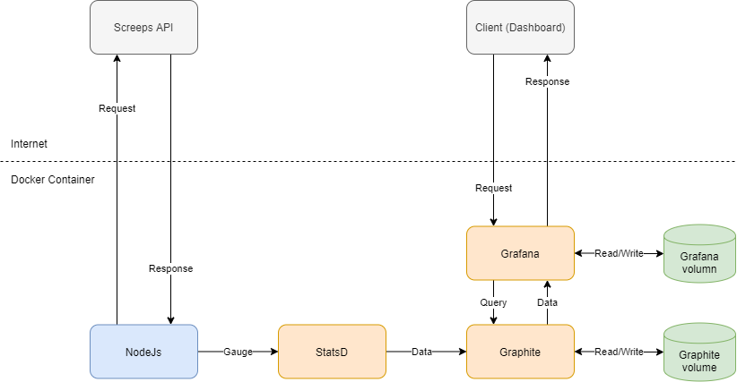

# screeps-grafana

One of the projects listed on the screeps third-party services page is [screeps-grafana](https://github.com/screepers/screeps-grafana). This is my experience getting a working dashboard showing stats collected from my screeps account.

## Technology Stack Overview

#### Technology

* [StatsD](https://github.com/statsd/statsd)
* [Graphite](https://graphite.readthedocs.io/en/stable/index.html)
* [Grafana](https://grafana.com/docs/grafana/latest/basics/)

#### Project Diagram



### StatsD

[StatsD ](https://github.com/statsd/statsd)is a network daemon that runs on the Node.js platform. It was originally written at [Etsy](http://www.etsy.com/) and released with a [blog post](https://codeascraft.etsy.com/2011/02/15/measure-anything-measure-everything/) about how it works and why we created it.

It is worth reading the blog post, but to summarise...

StatsD is a small server and accompanying client code which allows collecting metrics within an application. It was built to make sure the performance of the application is unaffected, using UDP for sending 'fire and forget' metrics and sampling parameters. The server then aggregates the data and pushes it to Graphite, acting as a buffer.

### Graphite

[Graphite](https://graphite.readthedocs.io/en/stable/index.html)'s documentation makes it very clear what it does:

1. Store numeric time-series data
2. Render graphs of this data on demand

Graphite consists of 3 software components:

1. **carbon** - a [Twisted](http://www.twistedmatrix.com/) daemon that listens for time-series data
2. **whisper** - a simple database library for storing time-series data \(similar in design to [RRD](http://oss.oetiker.ch/rrdtool/)\)
3. **graphite webapp** - A [Django](http://www.djangoproject.com/) webapp that renders graphs on-demand using [Cairo](http://www.cairographics.org/)

### Grafana

[Grafana](https://grafana.com/docs/grafana/latest/basics/) is an open source visualization and analytics software. It allows you to query, visualize, alert on, and explore your metrics no matter where they are stored. In plain English, it provides you with tools to turn your time-series database \(TSDB\) data into beautiful graphs and visualizations.

Grafana acts as a standardised front-end for the various database/graphing engines it supports, adding higher-level functionality.


## Initial setup - Docker

Following the steps listed for the self-hosted option, I downloaded the repository and got to work.

### Existing code - changed

screeps-grafana contains a coffee script which it uses to poll the screeps API and push the changed to Graphite \(more on that later\).


Use of username/password instead of API token


Before running the project, you need to configure some environment variables found in the docker-compose.env file.

* SCREEPS\_USERNAME
* SCREEPS\_EMAIL
* SCREEPS\_PASSWORD
* SCREEPS\_SHARD

I did not want to use my username and password so I modified the coffee script and .env file to take an API token instead.

#### Old request


```coffeescript
    options =
      uri: 'https://screeps.com/api/user/memory'
      method: 'GET' 
      json: true
      resolveWithFullResponse: true
      headers:
        "X-Token": token
        "X-Username": token
      qs:
        path: 'stats'
        shard: process.env.SCREEPS_SHARD
```


#### New request


```coffeescript
    options =
      uri: 'https://screeps.com/api/user/memory'
      method: 'GET' 
      json: true
      resolveWithFullResponse: true
      qs:
        path: 'stats'
        shard: process.env.SCREEPS_SHARD
        _token: process.env.SCREEPS_TOKEN
```


As we no longer needed a login step to get the token, the script could be simplified further.

```coffeescript
run: ( string ) ->
  /* ... */

  loop: () =>
    @main()

  main:() =>
    if (succes)
      @getMemory()
      return

    @client = new StatsD host: process.env.GRAPHITE_PORT_8125_UDP_ADDR
    @getMemory()

  getMemory: () =>
    /* ... */

  report: (data, prefix="") =>
    /* ... */
```

### Running the docker container

The docker container ran fine and I was able to see the example dashboard. However, none of the graphs appeared to be working.


Being new to this whole stack, I had no idea what was wrong.

### Fixing example dashboard

The project comes with the example dashboard 'sampleDashboard.json' and contains references to the metric 'screeps'. E.g. 'screeps.cpu.used'.

No such metric exists. In order to fix the dashboard I needed to replaced the term 'screeps' with 'stats.gauges'. Looking in the [StatsD](https://statsd.readthedocs.io/en/v3.1/types.html#gauges) documentation the following line sheds some light:

> The statsd server collects gauges under the stats.gauges prefix.

There was also a minor changed required for the 'room' variable which is defined in the dashboard settings. The stats exported on screeps uses the key 'rooms' instead of the example dashboard's 'room'.


#### Unfortunate Insight

Straight away a metric stands out... 


... poor Steve is going to be there a while before he sees the GCL tick over to level 7.

